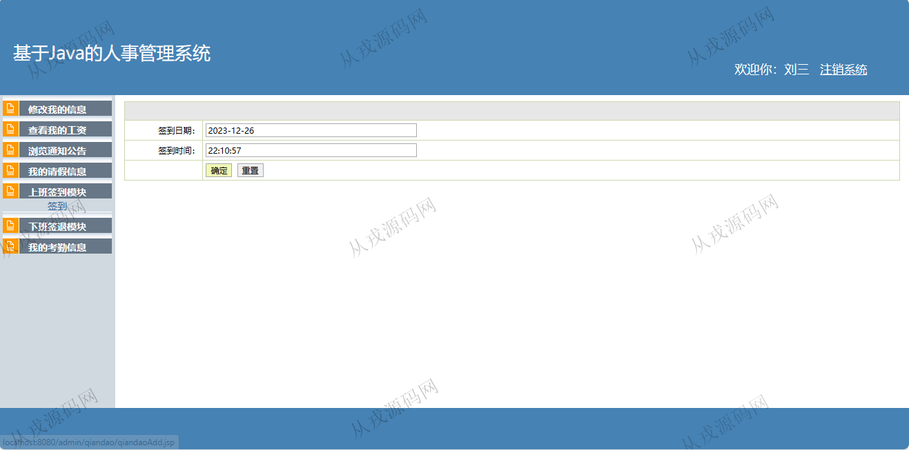

<h1 align="center">79.人事管理系统</h1>

 获取sql文件 QQ: 386869957 QQ群: 377586148 

 [推荐站点: 从戎源码网](https://armycodes.com/) 

## 简介

> 本代码来源于网络,仅供学习参考使用!
>
> 提供1.远程部署/2.修改代码/3.设计文档指导/4.框架代码讲解等服务
>
> 后端登录: http://localhost:8080/
>
> 管理员: 用户名: admin 密码: 1
> 
> 员工: 用户名: 0001  密码: 1

## 项目介绍
基于jsp+servlet的人事管理系统：有配套报告文档，前端 jsp、jquery，后端 servlet、jdbc，集成员工档案管理、公告浏览、请假信息管理、考勤信息管理等功能于一体的系统。

## 功能介绍

### 管理员

- 修改登录密码：需要输入原密码和新密码
- 部门信息管理：部门信息的增删改查
- 员工档案管理：员工档案信息的增删改查
- 通知公告管理：通知公告的增删改查
- 请假信息管理：请假信息的删除，审核
- 薪资信息是增加和删除
- 考勤信息管理：考勤信息列表查询

### 员工

- 我的信息：个人信息查看和修改
- 查看我的工资：工资详情查看，仅限本人信息查询权限
- 公告浏览：公告列表查询
- 我的请假：请假信息查询，请假信息删除，添加请假信息
- 上下班模块：上班签到，下班签退
- 我的考勤信息：仅限查询员工本人的考勤信息

## 环境

- <b>IntelliJ IDEA 2021.3</b>

- <b>Mysql 5.7.26</b>

- <b>Tomcat 7.0.73</b>

- <b>JDK 1.8</b>

## 运行截图

